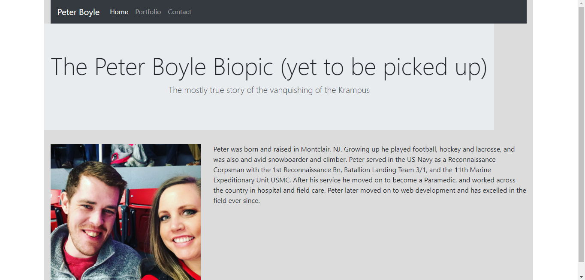
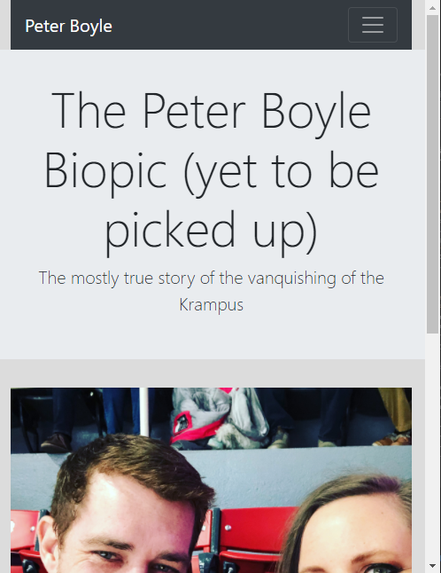
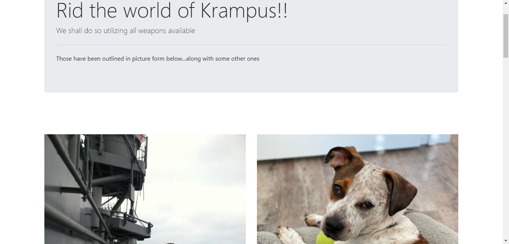
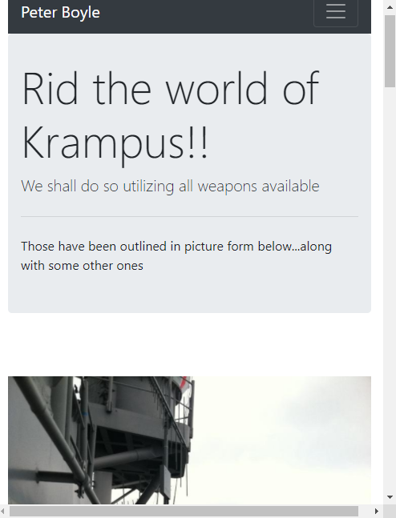

# Mobile_Responsive_Portfolio

Goal: 

# Mobile Responsive Portfolio

## Description: 
To build a portfolio emphasizing mobile responsiveness, accessibility, and readability.
Utilizing semantic tags, bootstrap formating, and instinctively ordered code, the resulting project will be easy to maintain and show excellent page load times. 
Formatting will transition seamlessly between mobile screens, to tablet, laptop and desktop screens with a layout fit for the correct size screen. Consistent code between pages will give the user fluidity from page to page. 
Through clean code, proper formating, reduced reference time for CSS, and layouts designed for change, this project will result in a site that shows excellent responsiveness, accessibility, readability, and speed. 
## Table of Contents

-[Description](#description)

-[Licenses](#licenses)

-[Deployed](#deployed)

-[Contact](#contact)

### Licenses: 

### Deployed: 
[https://boylepeter.github.io/Mobile_Responsive_Portfolio/](https://boylepeter.github.io/Mobile_Responsive_Portfolio/)

### Contact:

[Github](https://github.com/boylepeter)

[LinkedIn](https://www.linkedin.com/in/peter-boyle-22b5071b7/)

Email: [Boyle.Peter614@gmail.com](Boyle.Peter614@gmail.com)
